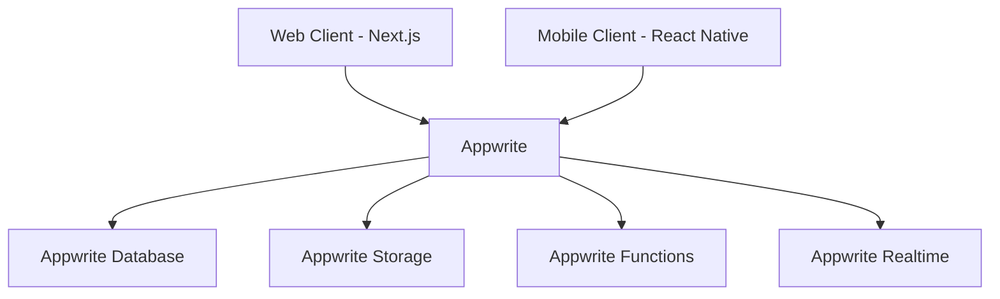

# SocialFlow: Social Media Content Planner
## Product Requirements Document (PRD) - MVP Version 1.0

## 1. Product Overview

### 1.1 Product Vision
SocialFlow is a comprehensive social media content planning platform that enables content creators and social media managers to visually plan and organize their social media content through an intuitive drag-and-drop calendar interface.

### 1.2 MVP Scope
The MVP focuses on delivering a robust visual calendar system for content planning, basic post management, and multi-platform support, with manual posting to social media platforms.

### 1.3 Target Users
**Primary:** Content creators and social media managers

**User Characteristics:**
- Manages multiple social media accounts
- Needs to plan content in advance
- Requires visual organization of content
- Works with various content types across platforms

### 1.4 Business Model
**Freemium model with subscription tiers**

**Free Tier Limitations:**
- Up to 2 social media accounts
- Basic calendar features
- Limited templates

**Paid Tier Features:**
- Unlimited social media accounts
- Advanced template features
- Extended calendar view options
- Priority support

## 2. Technical Architecture

### 2.1 Technology Stack

**Frontend (Web):**
- Next.js 14+
- TypeScript
- TailwindCSS for styling
- Zustand for state management
- React DnD for drag-and-drop functionality
- Appwrite SDK for authentication and backend services([1](https://appwrite.io/docs/quick-starts/nextjs))

**Frontend (Mobile):**
- React Native
- TypeScript
- Zustand for state management
- React Native Reanimated for animations
- Appwrite React Native SDK([2](https://appwrite.io/blog/post/introducing-appwrite-react-native-sdk))

**Backend Services (Appwrite):**([3](https://appwrite.io/))
- Authentication
- Databases
- Storage
- Realtime
- Functions
- Messaging

### 2.2 System Architecture


## 3. Core Features Specification

### 3.1 Visual Calendar

**Requirements:**
- Drag-and-drop interface for post arrangement
- Multiple view options (day, week, month)
- Visual indicators for different post types and platforms
- Quick post preview on hover
- Post status indicators (draft, ready, needs review)

**Technical Implementation:**
- Use React DnD for drag-and-drop functionality
- Implement virtual scrolling for performance
- Real-time updates using WebSocket
- Responsive design for all screen sizes

### 3.2 Post Management

**Requirements:**
- Create, edit, and delete posts
- Support for multiple content types (text, images, videos)
- Platform-specific post formatting
- Draft saving
- Template system
- Tagging and categorization

**Post Data Model:**
```typescript
interface Post {
  id: string;
  title: string;
  content: string;
  mediaUrls: string[];
  platforms: Platform[];
  scheduledDate: Date;
  status: 'draft' | 'ready' | 'needs_review';
  tags: string[];
  templateId?: string;
  createdAt: Date;
  updatedAt: Date;
}
```

### 3.3 Platform Support

**Supported Platforms:**
- Facebook
- Instagram
- Twitter (X)
- LinkedIn
- TikTok
- Google Business

**Platform-Specific Requirements:**
- Character limits
- Media format restrictions
- Platform-specific preview
- Custom fields per platform

## 4. User Interface Specifications

### 4.1 Key Screens

**Dashboard:**
- Calendar view (main component)
- Quick actions sidebar
- Platform filter
- Date navigation

**Post Editor:**
- Platform selector
- Media upload area
- Text editor
- Preview panel
- Template selector

**Template Manager:**
- Template list
- Template editor
- Category management

### 4.2 Design Guidelines
- Implement dark/light mode
- Use consistent color scheme across platforms
- Ensure accessibility compliance
- Mobile-responsive design
- Platform-specific preview modes

## 5. Data Models

### 5.1 Core Entities

```typescript
interface User {
  id: string;
  email: string;
  name: string;
  subscription: SubscriptionTier;
  socialAccounts: SocialAccount[];
}

interface SocialAccount {
  id: string;
  platform: Platform;
  accountName: string;
  accountType: 'personal' | 'business';
}

interface Template {
  id: string;
  name: string;
  content: string;
  platformSettings: PlatformSetting[];
  tags: string[];
}

interface Calendar {
  id: string;
  userId: string;
  posts: Post[];
  view: 'day' | 'week' | 'month';
}
```

## 6. API Endpoints

### 6.1 Core Endpoints

```typescript
// Posts
POST /api/posts - Create new post
GET /api/posts - Get posts list
PUT /api/posts/:id - Update post
DELETE /api/posts/:id - Delete post

// Calendar
GET /api/calendar - Get calendar data
PATCH /api/calendar/reorder - Update post order

// Templates
GET /api/templates - Get templates
POST /api/templates - Create template
PUT /api/templates/:id - Update template
```

## 7. Security Requirements

### 7.1 Authentication & Authorization

**Appwrite Authentication Implementation:**

**Initialize Appwrite Client:**
```typescript
// lib/appwrite.ts
import { Client, Account, Databases } from 'appwrite';

export const client = new Client()
    .setEndpoint('https://cloud.appwrite.io/v1')
    .setProject('<PROJECT_ID>'); // Your project ID

export const account = new Account(client);
export const databases = new Databases(client);
```

**Protected API Routes:**
```typescript
// pages/api/protected.ts
import { account } from '@/lib/appwrite';

export default async function handler(req, res) {
  try {
    const user = await account.get();
    // Route logic
  } catch (error) {
    return res.status(401).json({ error: "Unauthorized" });
  }
}
```

**User Profile Management:**([4](https://appwrite.io/docs/products/auth))
- Email/Password authentication
- OAuth2 social providers
- Phone authentication
- Magic URL
- Anonymous sessions
- JWT tokens
- Custom claims and roles

**Security Features:**
- Multi-factor authentication([5](https://appwrite.io/blog/post/everything-new-with-appwrite-1.5))
- Social login providers:
  - Google
  - Facebook
  - Twitter
  - LinkedIn
- Session management
- Secure token handling
- Rate limiting
- Input validation and sanitization

### 7.2 Data Models Update

```typescript
// Updated User model to work with Appwrite
interface User {
  $id: string; // Appwrite User ID
  email: string;
  name: string;
  preferences?: {
    defaultView: 'day' | 'week' | 'month';
    defaultPlatforms: Platform[];
    theme: 'light' | 'dark';
  };
  settings?: {
    notifications: NotificationPreferences;
    timezone: string;
    language: string;
  };
}
```

### 7.3 Environment Configuration

```env
# Appwrite Environment Variables
NEXT_PUBLIC_APPWRITE_ENDPOINT=https://cloud.appwrite.io/v1
NEXT_PUBLIC_APPWRITE_PROJECT_ID=your-project-id
```

## 11. Authentication Implementation Guide

### 11.1 Web Implementation

**Install Appwrite SDK:**
```bash
npm install appwrite
```

**Initialize Appwrite in your app:**
```typescript
// app/layout.tsx
import { client, account } from '../lib/appwrite';

// SSR implementation
export async function getServerSideProps(context) {
  try {
    const user = await account.get();
    return { props: { user } };
  } catch (error) {
    return { props: { user: null } };
  }
}
```

**Implement sign-in and sign-up:**
```typescript
// app/auth/page.tsx
import { account } from '@/lib/appwrite';

export default function AuthPage() {
  const login = async (email: string, password: string) => {
    try {
      await account.createEmailSession(email, password);
      // Handle successful login
    } catch (error) {
      // Handle error
    }
  };

  const register = async (email: string, password: string, name: string) => {
    try {
      await account.create('unique()', email, password, name);
      await login(email, password);
    } catch (error) {
      // Handle error
    }
  };

  return (
    // Your auth UI components
  );
}
```

### 11.2 Mobile Implementation

**Initialize Appwrite in your React Native app:**
```typescript
// App.tsx
import { Client, Account } from 'appwrite';

const client = new Client()
    .setEndpoint('https://cloud.appwrite.io/v1')
    .setProject('your-project-id');

const account = new Account(client);

export default function App() {
  return (
    <NavigationContainer>
      <RootNavigator />
    </NavigationContainer>
  );
}
```